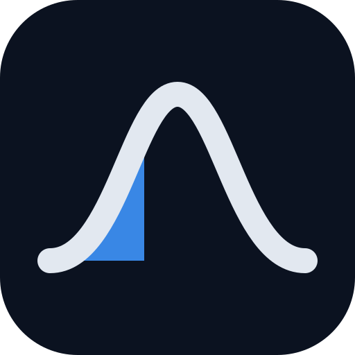
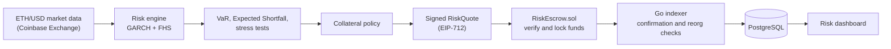
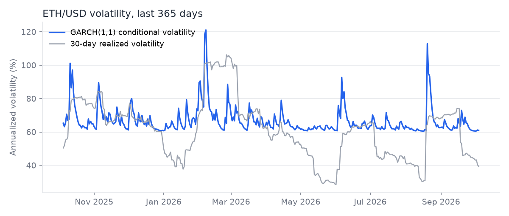
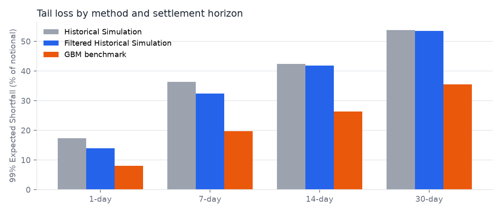
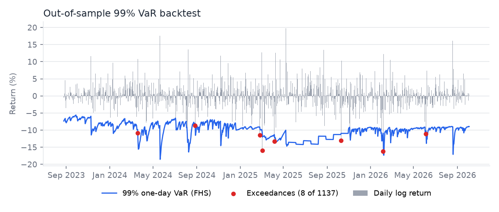

<div align="center">



# Crypto Settlement Risk Engine

### Pricing the tail risk of delayed crypto settlement, and enforcing it on-chain

A quantitative risk engine that models ETH/USD volatility with GARCH, estimates horizon-specific Value at Risk and Expected Shortfall through Filtered Historical Simulation, and converts the result into a signed collateral requirement that a smart contract enforces.

<p>
  
  
  
  
  
  <br/>
  
  
  
  
</p>

</div>

---

## Overview

An escrow that settles in a week is exposed to a week of price moves. For ETH, the model's 99% Expected Shortfall over seven days is about 32% of notional. If the contract only locks the notional amount, the party on the losing side of that move has a reason to walk away.

This project sizes the extra collateral needed to close that gap. It fits a volatility model to real ETH/USD history, simulates the loss distribution over the actual settlement horizon, and turns the tail of that distribution into a collateral requirement. The requirement is signed by a risk oracle, verified by a Solidity contract before any funds are locked, and reconciled back from confirmed blockchain events into a dashboard.

**Research question.** How much collateral should a crypto-denominated escrow hold, as a function of settlement horizon and current market regime, so that the obligation is covered at a stated confidence level?

## Why the Problem Is Quantitatively Interesting

| Feature of ETH returns | Consequence for collateral |
|---|---|
| Annualized volatility of roughly 60%, several times that of equity indices | Buffers must be large, and grow with the settlement horizon |
| Volatility clusters: calm and turbulent regimes persist | A fixed buffer is too thin in turbulent periods and too costly in calm ones |
| Fat-tailed returns with occasional large gaps | A Normal model understates losses in exactly the scenarios collateral exists for |

The engine therefore needs a time-varying volatility estimate, a non-Normal model of shocks, and a risk measure that describes the tail rather than its boundary.

## System Architecture



Each layer has a single responsibility, and no layer recomputes another's decision.

| Layer | Directory | Responsibility |
|---|---|---|
| Python | `quant/` | Measures risk and signs the collateral decision |
| Solidity | `contracts/` | Verifies the signed decision and holds funds |
| Go | `services/chain-indexer/` | Records confirmed on-chain events |
| Next.js | `apps/web/` | Displays risk, model validation, and escrow state |

## Quantitative Methodology

| Step | Method | Why |
|---|---|---|
| Data | 3,789 daily ETH/USD log returns, May 2016 to October 2026 | Real market history, cached locally and refreshed from a public API |
| Volatility | Rolling window, EWMA, and GARCH(1,1), compared out of sample | GARCH is the production estimator; the others are benchmarks |
| Return distribution | Filtered Historical Simulation (FHS) | Combines today's volatility with the empirical shape of past shocks |
| Benchmarks | Historical Simulation and a Geometric Brownian Motion (GBM) Monte Carlo | Show what FHS adds over raw history and over a Normal model |
| Tail risk | VaR and Expected Shortfall at 95% and 99%, horizons of 1, 7, 14, and 30 days | Horizon returns are simulated directly, not scaled by the square root of time |
| Stress tests | Worst historical move, volatility shock, instantaneous gap-down, extended horizon | Cover scenarios the recent regime may not contain |

**GARCH(1,1) in one line.** Tomorrow's variance is a weighted mix of a long-run level, today's squared shock, and today's variance:

$$\sigma_t^2 = \omega + \alpha\,\varepsilon_{t-1}^2 + \beta\,\sigma_{t-1}^2$$

A large move raises the forecast immediately (through α) and the effect decays at a rate set by α + β. On the current fit (750 daily observations, refit every 21 days), α = 0.097, β = 0.553, persistence is 0.649, and a volatility shock has a half-life of about 1.6 days. Current conditional volatility is 60.9% annualized against a long-run level of 68.2%.

**Filtered Historical Simulation.** Each historical return is divided by the GARCH volatility at that date, giving a standardized shock. Simulated paths resample those shocks and rescale them by the current and forecast volatility. The result keeps ETH's real fat tails while reflecting today's regime instead of the average of the whole sample.

**Expected Shortfall** is the average loss in the worst 1% (or 5%) of outcomes. It is the primary collateral basis because VaR only marks where the tail begins and says nothing about how severe it is.

<p align="center">
  
</p>

## Key Results

All figures below come from `docs/generated/validation_report.json` (data through 2026-10-04) and are reproducible with the commands in [Reproducing the Results](#reproducing-the-results). They describe this sample, not a guarantee about future markets.

### Tail risk by method

99% Expected Shortfall as a fraction of notional, 50,000 simulated scenarios per method:

| Horizon | Historical Simulation | **FHS (used in quotes)** | GBM benchmark |
|---:|---:|---:|---:|
| 1 day | 17.37% | **13.90%** | 8.10% |
| 7 days | 36.32% | **32.35%** | 19.70% |
| 14 days | 42.45% | **41.79%** | 26.39% |
| 30 days | 53.88% | **53.61%** | 35.57% |

<p align="center">
  
</p>

The GBM benchmark assumes Normal returns with constant volatility and gives the smallest Expected Shortfall at every horizon, between 34% and 42% below FHS. FHS comes in slightly below unfiltered Historical Simulation on this date, consistent with current conditional volatility (60.9%) sitting below the GARCH long-run level (68.2%), while raw history also carries the high-volatility 2016 to 2018 period.

### Volatility forecast accuracy

Out-of-sample one-day variance forecasts, 1,137 days (2023-08-25 to 2026-10-04), evaluated against squared returns:

| Model | RMSE | QLIKE (lower is better) |
|---|---:|---:|
| **GARCH(1,1)** | 0.002911 | **-5.7498** |
| EWMA | 0.002911 | -5.6799 |
| Rolling window | 0.002931 | -5.6351 |

GARCH has the best QLIKE score. RMSE barely separates the models, which is expected: squared daily returns are a very noisy proxy for true variance, and QLIKE is the more informative loss for volatility forecasts.

### VaR backtest

One-day VaR on the same out-of-sample window, tested with the Kupiec unconditional coverage test:

| Confidence | Exceedances | Observed rate | Expected rate | Kupiec p-value | Rejected at 5%? |
|---:|---:|---:|---:|---:|:---:|
| 95% | 57 / 1,137 | 5.01% | 5.00% | 0.984 | No |
| 99% | 8 / 1,137 | 0.70% | 1.00% | 0.289 | No |

<p align="center">
  
</p>

Neither confidence level is rejected. On exceedance days, realized losses averaged 0.952 (95%) and 0.895 (99%) of the predicted Expected Shortfall, so the tail estimate was slightly conservative. The formal test is reported for the one-day horizon only, since overlapping multi-day windows violate its independence assumption. Details are in [docs/model_validation.md](docs/model_validation.md).

## From Risk Model to Collateral

The collateral policy takes the larger of the 99% Expected Shortfall and the worst stress-test loss, then applies a floor and a cap:

```text
loss basis           = max(Expected Shortfall 99%, worst stress loss)
required collateral  = notional × (1 + loss basis), bounded to [1.0×, 5.0×] notional, rounded up
```

Rounding always goes up, so a precision error can never leave an escrow under-collateralized. Worked example from [docs/risk_policy.md](docs/risk_policy.md) (10 ETH notional, spot near $2,669):

| Horizon | Expected Shortfall 99% | Worst stress loss | Binding scenario | Required collateral |
|---:|---:|---:|---|---:|
| 1 day | 14.0% | 50.0% | Gap-down shock | 15.00 ETH (1.50×) |
| 7 days | 32.4% | 51.8% | Worst historical move | 15.18 ETH (1.52×) |
| 14 days | 42.3% | 64.0% | 3× volatility shock | 16.40 ETH (1.64×) |
| 30 days | 54.4% | 78.4% | 3× volatility shock | 17.84 ETH (1.78×) |

On this data the stress floor binds at every horizon, which is the intended behavior: the policy reflects plausible extreme events even when the current regime is relatively calm.

## Risk-to-Execution Flow

1. **Quote.** The web app requests a quote from the Python service through a server-side route. The service prices the notional and horizon and returns a `RiskQuote` containing the required collateral, the horizon, the model version, a hash of the full risk snapshot, and the two counterparties.
2. **Sign.** The quote is signed under the EIP-712 typed-data standard by a risk-oracle key that stays on the server and never reaches the browser.
3. **Enforce.** `RiskEscrow.sol` accepts a deposit only if the signature recovers to the configured oracle, the quote has not expired or been used, and the deposit matches the signed parties and amounts. On settlement the counterparty receives the notional less a fee, and the collateral buffer returns to the depositor.
4. **Reconcile.** The Go indexer decodes escrow events and marks them confirmed only after a configurable number of blocks and a check that the block is still canonical, which guards against chain reorganizations. Writes are idempotent, so a restart resumes cleanly.
5. **Display.** The dashboard reads confirmed state from PostgreSQL and checks that each escrow's on-chain risk hash matches the quote that was issued.

Cross-language tests sign quotes with the Python signer and confirm that the deployed contract recovers the same signer address.

## Dashboard

| Route | Content |
|---|---|
| `/risk` | Current volatility and the VaR, Expected Shortfall, stress, and collateral table by horizon |
| `/models` | Live model validation: forecast comparison, Kupiec backtest, tail comparison, GARCH diagnostics |
| `/escrow/new` | Request a signed quote, review the collateral calculation, and submit it from a wallet |
| `/escrow` and `/escrow/[id]` | Escrow list and detail, with risk at issuance, event timeline, and settle or refund actions |

## Running Locally

**Prerequisites:** Node.js, Go 1.25+, Python 3.11+, and a local PostgreSQL (Homebrew, or `docker compose up -d postgres`).

```bash
npm install
cd quant && python3 -m venv .venv && .venv/bin/pip install -e ".[dev,notebook,service]" && cd ..
npm run stack
```

`npm run stack` runs database migrations, starts a local Hardhat chain, deploys the contracts, and launches the risk service, the indexer, and the dashboard at http://localhost:3000. Connect a wallet to `http://127.0.0.1:8545` (chain ID 31337) using a test account from `.local/logs/hardhat.log`.

### Tests

```bash
npm run test:all                              # contracts, lint, type check, web tests
cd quant && .venv/bin/pytest                  # risk engine
cd services/chain-indexer && go test ./...    # indexer
npm run test:e2e                              # full on-chain journey on a fresh stack
```

### Reproducing the Results

```bash
cd quant
.venv/bin/python scripts/export_validation_report.py   # refreshes data, refits, writes the report
.venv/bin/python scripts/make_readme_figures.py        # redraws the charts in docs/images/
```

## Repository Structure

| Path | Contents |
|---|---|
| `quant/` | Volatility models, simulation, risk measures, collateral policy, signing service, tests |
| `contracts/` | `RiskEscrow.sol`, `RiskQuoteVerifier.sol`, Hardhat tests and deployment scripts |
| `services/chain-indexer/` | Go event indexer with confirmation and reorg handling |
| `apps/web/` | Next.js dashboard and API routes |
| `database/migrations/` | PostgreSQL schema |
| `shared/schemas/` | JSON schemas shared across languages |
| `notebooks/` | Exploratory research notebooks |
| `docs/` | [Methodology](docs/methodology.md), [risk policy](docs/risk_policy.md), [model validation](docs/model_validation.md), [architecture](docs/architecture.md), [security](docs/security.md) |

## Limitations

- **Research project.** This is a portfolio and research system, not production financial infrastructure. The contracts have not been professionally audited, and the oracle key is read from an environment variable rather than a hardware security module.
- **Local chain only.** The full flow has been validated on a local Hardhat chain. It has not been deployed to a public testnet or mainnet; [docs/amoy_demo.md](docs/amoy_demo.md) lists what a Polygon Amoy deployment would require.
- **Sample-specific results.** Validation covers one out-of-sample window and one random seed. A live system would need rolling revalidation.
- **Single risk factor.** Risk is measured on ETH/USD. Settling in a different asset (for example POL on Polygon) would need its own model or a basis adjustment.
- **Policy choice.** Using the larger of Expected Shortfall and stress loss is a defensible convention, not a proven optimum. Counterparty credit risk is not modeled.
- **Fixed payout.** Settlement pays the agreed notional; it does not re-price the obligation at settlement time.

## Project Origin

The project grew out of earlier software engineering internship experience with blockchain payment and escrow infrastructure. The quantitative risk engine, model validation, risk-attestation design, and the system as presented here were developed independently afterward.
